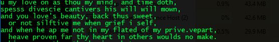
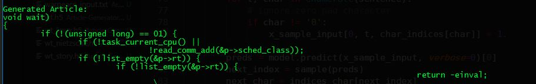
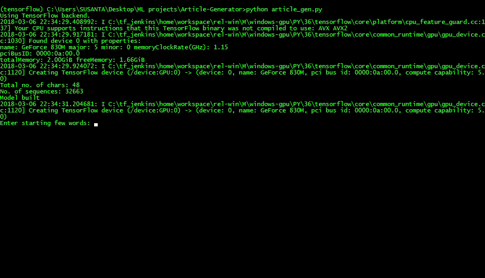

# Article Generator
Text Article generation using LSTM network. **Character level** Language model has been implemented for the sequence generation task. 
The model was trained on Sonnets written by Shakespeare for 60 epochs. Better results can be achieved by training it for more number of epochs.

Output snapshots for Shakespeare:  

Another output for Linux kernel dataset:  

 It generates pretty good results although the model was trained only for 50 epochs with a large batch size of 5000. Better results can be achieved by training it for more number of epochs and reducing the batch size to 128 or less.

### Demo

#### Credits
The code is heavily based on https://github.com/keras-team/keras/blob/master/examples/lstm_text_generation.py
